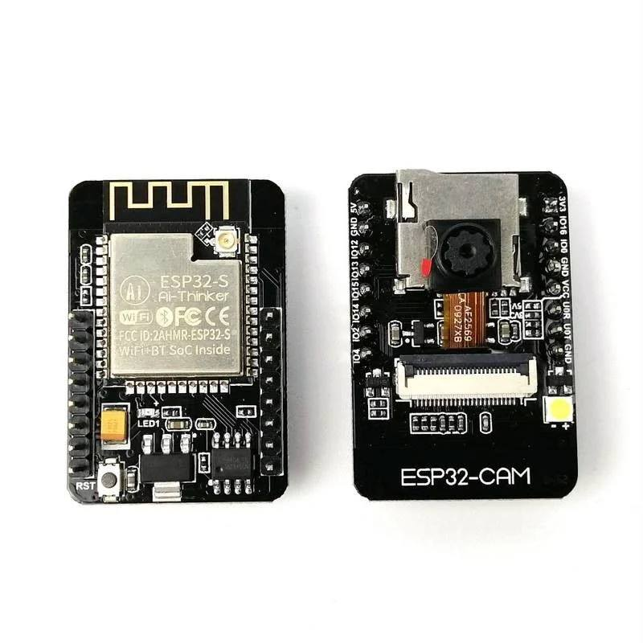

# esp32-cam-micropython
ESP32-CAM Micropython Example

My Components

1. OV2640 Camera
2. DHT11
3. LDR (3 Pin, Pull Down)

Installation

1. Flash with firmware from https://github.com/lemariva/micropython-camera-driver/tree/master/firmware or browse to /images/
2. import upip
3. upip.install('picoweb')
4. upip.install('micropython-ulogging')

Images

